# covid19-show
项目架构：HTML,CSS,JavaScript,jQuery,Servlet,aliOSS,JackSon,easyExcel,eCharts,highCharts,easyExcel,swiper.js

项目分后台管理和面向普通用户的疫情信息展示。

后台可对疫情信息轮播图，轮播信息，热门新闻，国内外数据及疫情趋势图，谣言信息，防疫知识等板块进行增删改；

疫情展示页可展示当前热点新闻，国内外疫情数据，谣言信息，防疫知识。

---

后台可对疫情信息轮播图，轮播信息，热门新闻，国内外数据及疫情趋势图，谣言信息，防疫知识等板块进行增删改；利用阿里osss完成图片上传存储，easyExcel实现疫情数据模板和修改疫情数据的功能

前端利用swpier.js来完成滑动切换板块及轮播图的设计，利用echart和highcharts来完成疫情趋势图和国内外疫情地图的设计，利用jq ajax来完成页面数据请求。

用到技术栈：servlet+html+jq+ajax+echarts+highcharts+swiper.js

后端依赖：

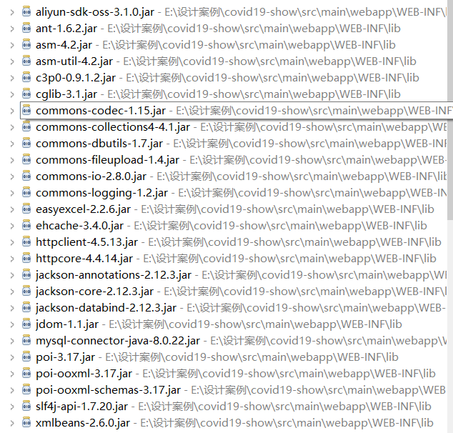

## 前端概述

前端全部利用ajax来完成页面的显示，对于这种单页面展示型，网站能用jsp或者模板引擎尽量用他们，可以较少系统复杂度也比较方便，当时因为结课要求，所以就选了这么几个技术栈；

面向用户的展示页面，初始化时会有疫情的数据，新闻的部分数据，部分谣言数据，部分对抗疫情知识的数据所有ajax会非常多，而chrom浏览器最多支持4个ajax并发请求，所以需要用到jq的`$.Deferred()`函数和 

```
$.when( d1, d2 ).done(function ( v1, v2) { 

	要执行的函数

}); 
```

来使方法同步，链式调用，避免所有ajax同时请求 造成并发错误。具体可看源码

同时利用echarts和highcharts来完成`疫情中国地图`和`疫情世界地图`和疫情趋势表的制作


## 后端概述

后端管理可以对展示页面所有要展示数据的修改，数据既可以流进来也可以流出去，避免无用数据。

在进行录入疫情数据时只需要录入关键数据，其他数据为后端根据关键数据计算所得。

后端可以上传图片，视频。

可以下载当前疫情 数据的excel格式，并且可以以所下载 的数据excel为模板对疫情数据进行修改，修改完可以提交刚刚修改 的excel。后端读取上传来的excel进行数据更改；

## 页面展示：

后台登录

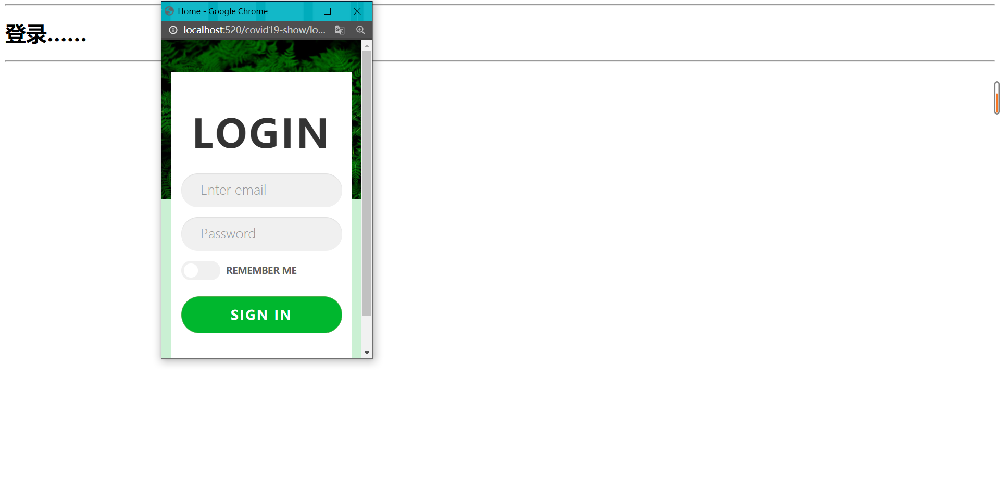

-----

后台管理：
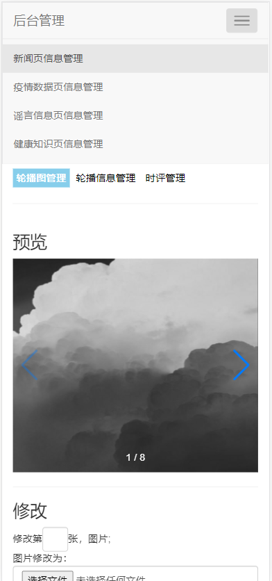

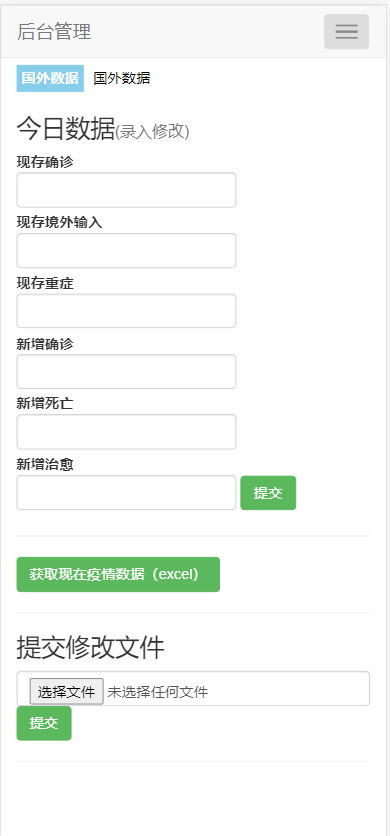

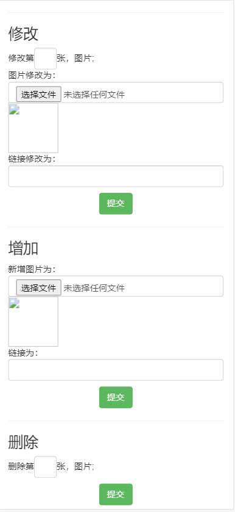

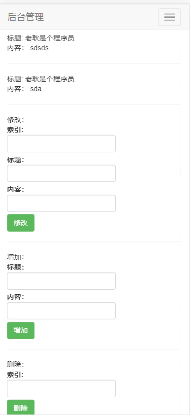

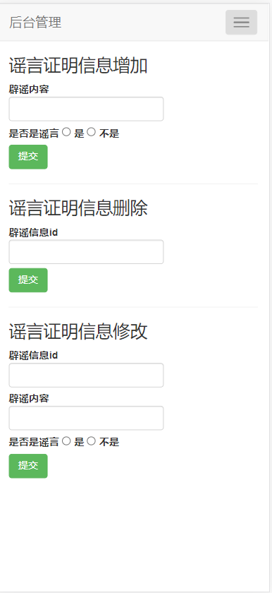

展示页面：

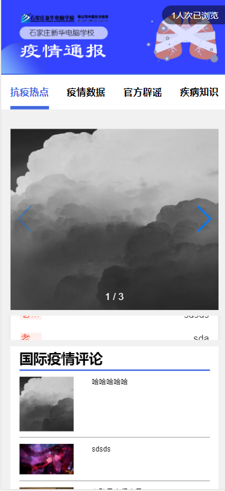

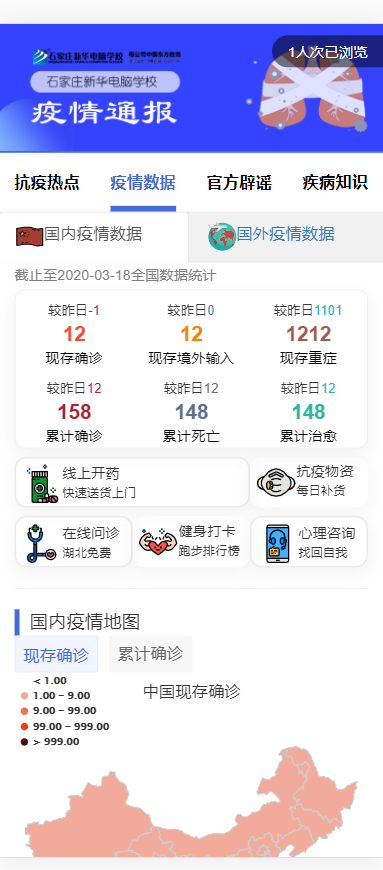

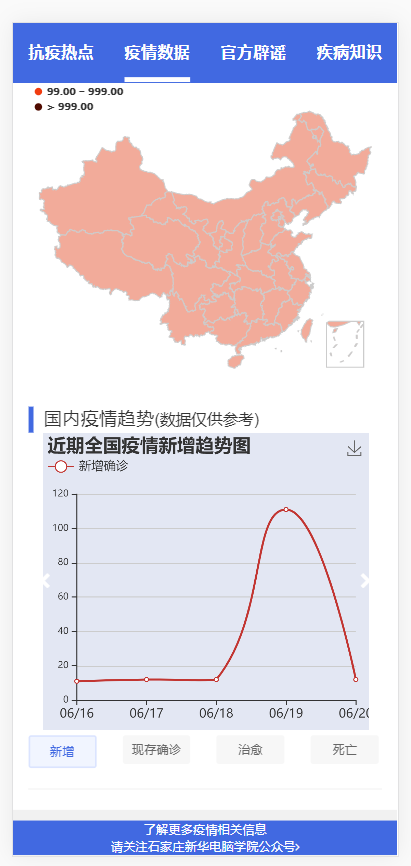

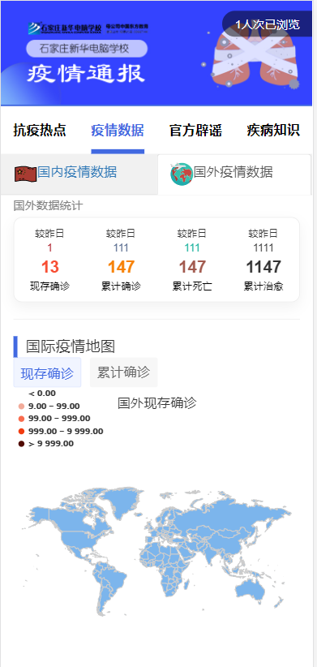


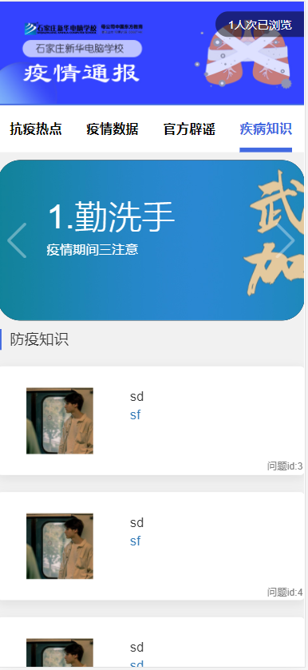